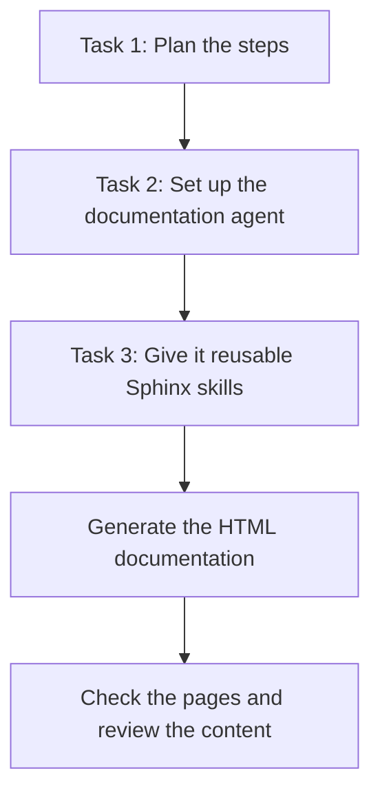
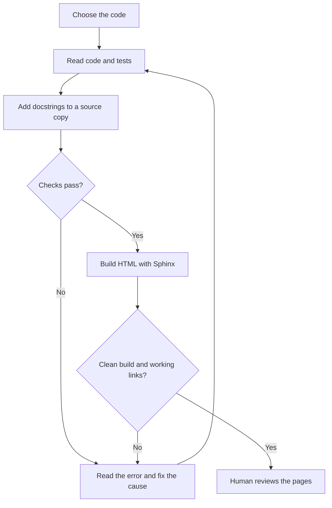

# Simple Walkthrough: Tasks 1, 2, and 3

**The goal:** create a documentation website for the ticketing system, with an AI
agent and reusable commands to rebuild it when the code changes.

## The Big Picture



| Term | Plain meaning |
| --- | --- |
| Agent | Copilot configured to follow our documentation workflow. |
| Skill | Instructions for a specific job, such as building documentation. |
| Docstring | An explanation written inside Python code. |
| Pipeline | A script that runs steps in the correct order. |
| Sphinx | The tool that turns documentation into web pages. |

## Task 1: Plan the Workflow

**What to do:** draw the steps the agent must follow before writing any automation.

1. **Choose the scope:** decide which code and audience to document.
2. **Understand the code:** read the source and tests before explaining it.
3. **Write docstrings:** describe what the code actually does.
4. **Build the website:** use Sphinx after the code checks pass.
5. **Review and maintain:** check the pages and repeat after code changes.



**Why:** the order prevents us from building documentation from untested or
incorrect explanations. If a check fails, fix the cause before continuing.

**Your output:** [workflow diagram and explanation](documentation-workflow.md).
There is also a [standalone SVG diagram](documentation-workflow.svg).

## Task 2: Set Up the Documentation Agent

**What to do:** turn the Task 1 plan into instructions and an executable workflow.

1. Create the [documentation agent definition](../.github/agents/ticket-documentation.agent.md).
   Give it a name, allowed tools, workflow steps, and safety rules.
2. Read the selected code and prepare the [docstring plan](documentation_agent/sample-plan.json).
   This lists which symbols to explain and the text to add.
3. Use the [pipeline script](documentation_agent/pipeline.py) to apply that plan
   to a separate source copy, run tests, and then generate documentation.
4. In VS Code's agent picker, select **Ticket Documentation** and give it a request.

Example request:

> Use the existing sample plan and tests to document the exercise models. Include
> the ticketing guides, run all validation steps, and show me the HTML output.

**Why:** the agent decides what to document from source evidence; the script makes
sure tests pass before Sphinx runs. Original application files are not overwritten.

**Our example:** generated code references cover [the exercise models](app/models.py),
not every application module. The written guides also explain the UI, API, and storage.

**Your output:** the agent definition, docstring plan, pipeline, and test results.
See the [detailed Task 2 guide](documentation_agent/INTEGRATION.md) for implementation details.

## Task 3: Add Three Reusable Skills

**What to do:** give the agent clear instructions for checking, building, and verifying.

| Skill | Job | File |
| --- | --- | --- |
| `sphinx-preflight` | Check dependencies, source paths, and documentation inputs. | [Preflight skill](../.github/skills/sphinx-preflight/SKILL.md) |
| `sphinx-build` | Apply docstrings to a copy, run tests, and generate HTML. | [Build skill](../.github/skills/sphinx-build/SKILL.md) |
| `sphinx-verify` | Check build results, local links, anchors, and page navigation. | [Verify skill](../.github/skills/sphinx-verify/SKILL.md) |

Each skill explains its purpose, parameters, example command, and expected output.
They all use the same [Python helper](documentation_agent/sphinx_skills.py).
The Markdown files contain instructions; the Python helper does the work.

**Remember:** preflight alone does not run tests or generate HTML. The build command
includes preflight and verification, so it is the simplest way to run everything.

**Your output:** three skills and a website with ticket guides, API documentation,
model references, sidebar navigation, and search.

## Quick Run

Run these commands in **PowerShell from the repository root**. This workspace
already has a Python environment. On a new machine, create one first using
`py -3.13 -m venv .venv`.

### 1. Install Dependencies

```powershell
.\.venv\Scripts\python.exe -m pip install -r "Debugging Task/requirements.txt"
.\.venv\Scripts\python.exe -m pip install -r "Debugging Task/documentation_agent/requirements.txt"
```

### 2. Build the Documentation

This PowerShell array keeps the command readable. Run the whole block together:

```powershell
$buildArgs = @(
    "Debugging Task/documentation_agent/sphinx_skills.py", "build",
    "--source", "Debugging Task/app",
    "--plan", "Debugging Task/documentation_agent/sample-plan.json",
    "--tests", "Debugging Task/documentation_agent/sample_tests",
    "--guides", "Debugging Task/documentation_agent/guides",
    "--output", "Debugging Task/documentation_agent/runs"
)
.\.venv\Scripts\python.exe @buildArgs
```

The result prints a new run directory and the HTML entry point. Open that HTML
file in your browser. Each build creates a separate run; earlier output is retained.

### 3. Check the Result

- Require **zero Sphinx warnings and errors**. Do not turn off warning checks.
- Confirm the build's tests and local-link verification passed.
- Open each guide, return home, and search for `TicketUpdate`.
- Review the wording against the code before approving or publishing it.

To run the documentation tooling's regression tests separately:

```powershell
.\.venv\Scripts\python.exe -m unittest discover -s "Debugging Task/documentation_agent/tests" -v
```

[Open the previously generated documentation](documentation_agent/runs/run-_y483kck/html/index.html).
That saved run recorded **15 tooling tests and 5 sample tests passing**, **10 pages**,
and **330 valid local references**. Those are previous results; rerun after changes.

For standalone preflight/verify commands and logs, see [the Task 3 guide](documentation_agent/TASK3.md).
Automatic checks do not prove the wording is correct or that external links work.

## Documentation Is Not the Live App

| Documentation website | Live Ticket Desk |
| --- | --- |
| Explains how the system works. | Lets you create and manage tickets. |
| Opens from a local HTML file. | Opens at <http://127.0.0.1:8001/>. |
| Does not need a server. | Needs the Python server running. |

Start the application when port 8001 is free:

```powershell
.\.venv\Scripts\python.exe -m uvicorn app.main:app --app-dir "Debugging Task" --host 127.0.0.1 --port 8001
```

Keep that terminal open. If the application is already running on that port, use
it instead of starting another copy. Stopping the server does not delete either site.
Starting the app can create and seed its database; documentation generation does not
need to start the app.

## Where Everything Lives

- Active agent: root `.github/agents/` directory.
- Active skills: root `.github/skills/` directory.
- Scripts, plans, guides, and generated output: `Debugging Task/documentation_agent/`.
- GitHub submission copies: [the day2 folder](https://github.com/geraldting17/Practical-AI-Coding-and-Debugging-with-Github-Copilot-9-11-September-2026/tree/main/day2).

Only the agent and three skill Markdown files were uploaded in that submission.
They are not a complete runnable project without the helper scripts and other
inputs. Generated HTML is local and must be rebuilt if missing after cloning.
This walkthrough has not been uploaded.

**In short:** Task 1 plans the process, Task 2 implements it, and Task 3 makes it
reusable. Build, check, and then have a person review the result.

To view the diagrams, open this file's Markdown preview. Mermaid support depends
on the viewer; the Task 1 SVG linked above can also be opened directly.